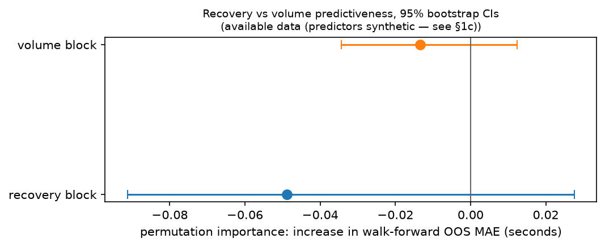
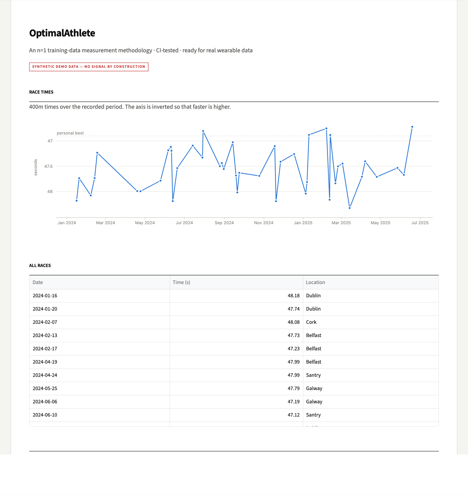

# OptimalAthlete — an n=1 training-data measurement methodology

[](https://github.com/hugomagee/OptimalAthlete/actions/workflows/ci.yml)
[](https://www.python.org/downloads/)
[](LICENSE)

A pipeline for turning training-session and race data into features, models and honest
evaluation — built around my own 400m data, and rebuilt after I found that its headline
result was an artefact of my evaluation protocol rather than a finding about athletes.

**The retraction.** An earlier version of this project claimed **R² = 0.84** predicting
400m race times from training features. That number is withdrawn. A full statistical
re-audit found it was produced by athlete-identity and temporal leakage: athletes were
pooled and split at random, so the model could learn *which athlete was racing* rather
than anything about their form. Under honest walk-forward validation the models do not
beat a "predict this athlete's recent average" baseline. The audit is in
[`analysis/recovery_vs_volume.ipynb`](analysis/recovery_vs_volume.ipynb) and the
methodology defence in [docs/ANALYSIS_NOTES.md](docs/ANALYSIS_NOTES.md).

What remains is the part that survives scrutiny: a CI-tested measurement methodology,
reproducible from a fresh clone, ready for real wearable data.


---

## The demonstration at the centre of this repo

The bundled synthetic database has a deliberate property: **race times are generated as
`personal_best + noise`, with no relationship to any training feature.** There is nothing
to learn. That makes it a test of the *evaluation protocol* rather than of the models,
and the two protocols disagree sharply:

| Protocol | Random Forest R² | What it means |
|---|---|---|
| **Walk-forward** (reported) | **0.654**, MAE 1.063 s over 163 races | Predicts only from earlier races. The R² comes from athlete identity, and the model is still **worse** than the baseline below. |
| Baseline: athlete's recent average | 0.950, MAE 0.487 s | A trivial rule with no ML at all — and it wins. |
| Naive pooled split (leaky) | ~~0.906~~ | Not a result. Athletes pooled, split at random. |

The leaky protocol reports **R² = 0.906 on data containing no signal whatsoever** — a
figure of the same magnitude as the 0.84 this project once claimed. That is the clearest
demonstration I can offer that the original number measured the protocol, not the athlete.

Both metric sets are computed by [`models.py`](models.py), persisted to
`models/model_metrics.json`, and displayed side by side in the dashboard.

---

## Changelog — bugs I found in my own pipeline

**Rolling features counted sessions, not days** *(fixed)*. Features named `avg_*_7d` and
`sessions_past_7d` used `rolling(window=7)`, which is a **7-row** window over sessions —
not a 7-day window. Every `*_7d` name was inaccurate, and `sessions_past_7d` was
structurally incapable of varying: it counted rows in a 7-row window, so it was always
`min(7, sessions so far)`. They now use genuine calendar windows (`'7D'`/`'14D'`) on a
date index. An athlete training daily and one training every fourth day now show ~7 and
~2 sessions per week; previously both reported 7. Regression test:
`tests/test_evaluation_protocols.py::test_session_counts_reflect_training_frequency_not_row_position`.

**The pipeline contradicted its own audit** *(fixed)*. The notebook demolished the pooled
random split, and then `models.py` trained with exactly that split and the dashboard
displayed the resulting metrics. Walk-forward is now the reported protocol; the pooled
split survives only as a labelled cautionary comparison.

**The demo was not reproducible** *(fixed)*. The synthetic generator was unseeded and
anchored to `datetime.now()`, so a fresh clone produced a different database and different
numbers on every run — which is why the README used to say results "vary substantially
between runs". It is now seeded with a fixed reference date, and the pipeline is
reproducible run to run.

**"R² = 0.84"** *(retracted)* — see above.

**"15 engineered features"** *(corrected to 12)* — the pipeline builds 12, recorded in
`models/model_metrics.json` and asserted in the test suite.

Finding and publishing your own errors is the point of this repository, not an
embarrassment to it.

---

## Quick start

Requires Python 3.12+.

```bash
git clone https://github.com/hugomagee/OptimalAthlete.git
cd OptimalAthlete
python3 -m venv venv && source venv/bin/activate
pip install -r requirements.txt
streamlit run dashboard.py
```

The dashboard opens at `http://localhost:8501`. On first run it creates the database,
generates the synthetic demo data, and trains the models — no manual setup.

### Running the pipeline manually

```bash
python data_loader.py
```

```bash
python models.py
```

`python models.py` prints the walk-forward results, the baseline comparison and the
verdict on whether the models beat it, then the pooled-split numbers labelled as leaky:

```
Best model under walk-forward: Random Forest (MAE 1.063s over 163 races)
Recent-average baseline:       MAE 0.487s
The model does NOT beat the baseline on this data — it has not demonstrated predictive value.

Naive pooled split, for contrast: RF test MAE 0.623s, R² 0.906 (leaky — not a result)
```

### Running the tests

```bash
pip install -r requirements-dev.txt && pytest && ruff check .
```

31 tests covering feature engineering, the rolling-window fix, model training, the
walk-forward protocol (including a test asserting it cannot anticipate a future level
shift), and data loading.

### Regenerating the screenshots

```bash
python tools/capture_screenshots.py
```

Renders each dashboard section and photographs it via headless Chrome, so the images in
this README are generated from the live app rather than taken by hand.

---

## The analysis notebook

**"Was recovery quality really more predictive of 400m performance than training volume?"**
— answered in [`analysis/recovery_vs_volume.ipynb`](analysis/recovery_vs_volume.ipynb)
([rendered on nbviewer](https://nbviewer.org/github/hugomagee/OptimalAthlete/blob/main/analysis/recovery_vs_volume.ipynb)).

> **Verified finding:** on the data available, neither recovery quality nor training volume
> showed out-of-sample predictive signal (importance difference −0.04 s, 95% CI −0.08 to
> +0.05, n=7 races) — and a provenance audit revealed the recovery/volume variables in the
> database are synthetic, so the earlier "2.3× more predictive" claim is retracted as
> unverifiable.



The notebook runs end-to-end on synthetic data in CI (`USE_SYNTHETIC=1`), so the analysis
cannot silently rot.

---

## Screenshots

| Overview | Training analysis |
| --- | --- |
|  |  |

| Race results | Model evaluation |
| --- | --- |
|  |  |

---

## What this system does

- **Feature engineering** — 12 features from training sessions and wellness metrics, using
  genuine calendar rolling windows (7 and 14 days): intensity, duration, HRV, sleep,
  fatigue, wellness, accumulated training load, session counts and a recovery score.
- **Models** — Random Forest and XGBoost regressors predicting 400m race time.
- **Evaluation** — walk-forward validation against a recent-average baseline, with the
  leaky pooled split retained for contrast.
- **Dashboard** — a Streamlit interface over the database showing training volume, session
  mix, race history and the model evaluation.

What it does **not** do is recommend training. There is no evidence base here for
prescribing anything to an athlete, and claiming otherwise would be the same category of
error as the R² this project retracted.

---

## Project structure

```
OptimalAthlete/
├── .github/workflows/ci.yml       # ruff + pytest + notebook execution
├── .streamlit/config.toml         # light theme configuration
├── analysis/
│   ├── recovery_vs_volume.ipynb   # the audit notebook
│   └── figures/                   # generated figures
├── data/                          # SQLite database (generated, gitignored)
├── docs/
│   ├── ANALYSIS_NOTES.md          # methodology defence + interview questions
│   ├── CV_CLAIMS.md               # defensible CV bullets, with proof pointers
│   ├── DEPLOYMENT.md              # Streamlit Community Cloud guide
│   └── screenshots/               # generated by tools/capture_screenshots.py
├── models/                        # trained models + metrics (generated, gitignored)
├── tests/                         # 31 tests
├── tools/capture_screenshots.py   # regenerates docs/screenshots/
│
├── setup_db.py                    # database schema
├── database.py                    # connection management
├── data_loader.py                 # seeded synthetic data generation
├── feature_engineering.py         # calendar-window rolling features
├── models.py                      # training + both evaluation protocols
├── dashboard.py                   # Streamlit dashboard
├── theme.py                       # shared visual theme
├── add_real_data.py               # real race result insertion
│
├── requirements.txt               # pinned runtime dependencies
├── requirements-dev.txt           # pytest, ruff, notebook execution
└── pyproject.toml                 # pytest and ruff configuration
```

---

## Portfolio context

This repository is one of a pair, sharing a thesis: **I audit my own numbers — and I
don't publish ones I can't back.**

- **OptimalAthlete** (this repo) — an n=1 measurement methodology, where I publicly
  retracted my own inflated R² after finding the leakage in my evaluation protocol that
  produced it, and then built the demonstration above to show exactly how it happened.
- **[TradeMetrics](https://github.com/hugomagee/TradeMetrics)** — a portfolio-analytics
  engine validated against simulated data with known ground truth, where the personal
  Sharpe ratio it once advertised has been removed because a one-year Sharpe is both
  unverifiable and statistically indistinguishable from noise.

Both are CI-tested, deterministic, and reproducible from a fresh clone.

The exact CV bullets this repository supports, each with a pointer to the code that proves
it, are in [docs/CV_CLAIMS.md](docs/CV_CLAIMS.md).

---

## Technology

| Tool | Purpose |
|---|---|
| pandas / numpy | data manipulation, calendar rolling windows |
| scikit-learn | Random Forest, metrics, the pooled-split comparison |
| XGBoost | gradient boosting regressor |
| SQLAlchemy + SQLite | schema and storage |
| Streamlit + Plotly | dashboard |
| pytest + ruff + GitHub Actions | tests, linting, CI |

---

## Roadmap

Completed:
- [x] Automated test suite and CI (ruff + pytest + notebook execution)
- [x] Statistical re-audit of the headline claim, published with the retraction
- [x] Walk-forward validation as the reported protocol, with a baseline comparison
- [x] Genuine calendar rolling windows
- [x] Deterministic, reproducible pipeline
- [x] One-click deployment to Streamlit Community Cloud

Next:
- [ ] Real wearable data via Garmin/Strava export (the methodology is ready; the data is not yet)
- [ ] Per-athlete models rather than pooled, once there is enough data per athlete
- [ ] Multi-event support (100m, 200m, 800m)

---

## Author

Final-year Science student, University College Dublin · 400m sprinter ·
targeting MSc Data Analytics.

Contact: hugo.magee1@ucdconnect.ie · [LinkedIn](https://www.linkedin.com/in/hugo-magee/)

## License

MIT — see [LICENSE](LICENSE).
