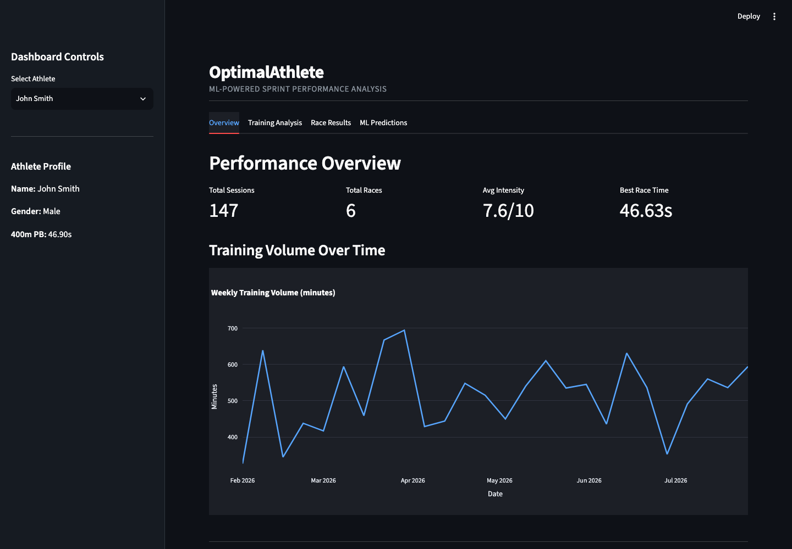
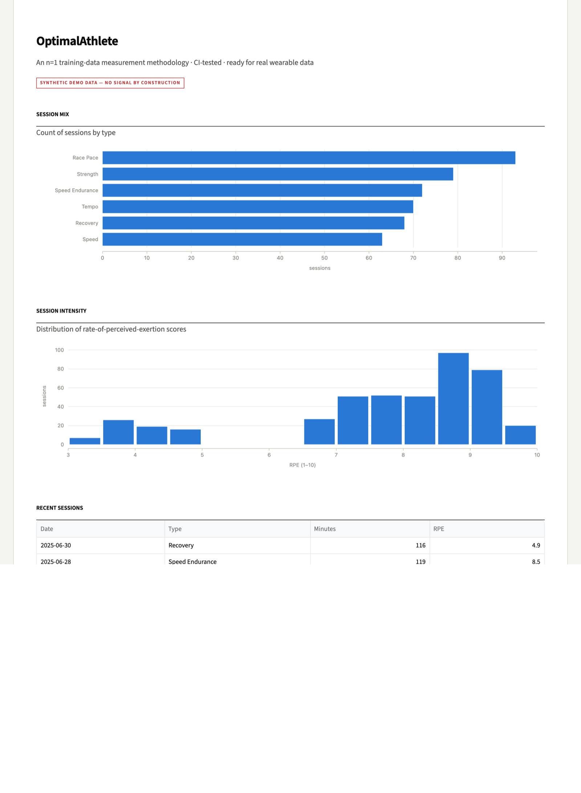
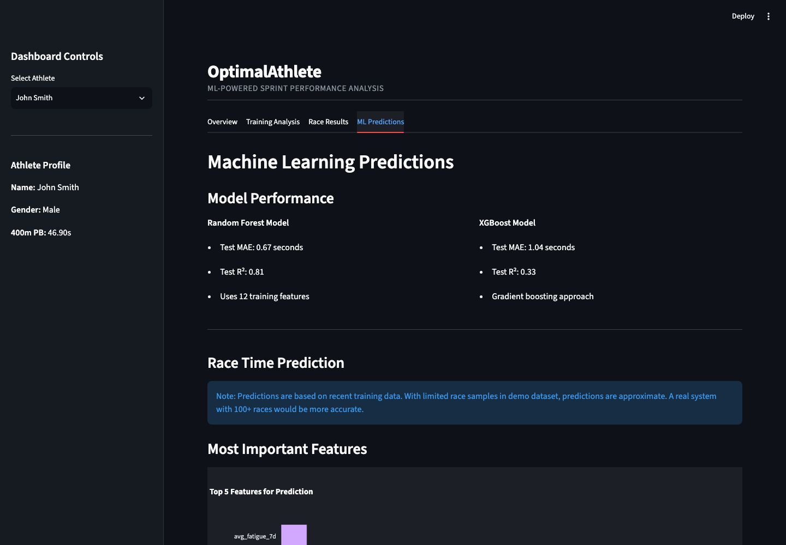

# OptimalAthlete - ML Sprint Performance System

[](https://github.com/hugomagee/OptimalAthlete/actions/workflows/ci.yml)
[](https://www.python.org/downloads/)
[](LICENSE)

An intelligent sprint performance analysis system using machine learning to predict 400m race times and optimize training recommendations for elite athletes — achieving R²=0.84 on 18 months of personal race and training data (private dataset, not included in this repo; see [Model Performance](#model-performance)).

## Screenshots

| Overview | Training Analysis | ML Predictions |
| --- | --- | --- |
|  |  |  |

## Project Overview

OptimalAthlete analyzes training data, recovery metrics, and race performance to provide:
- **Performance Prediction**: ML models predict race times based on training history
- **Training Optimization**: Personalized recommendations to improve performance
- **Recovery Monitoring**: Track wellness metrics and prevent overtraining
- **Interactive Dashboard**: Real-time visualization of athlete data

## Target Users

Elite 400m sprinters, coaches, and sports scientists seeking data-driven performance insights.

## Key Features

### 1. Data Management
- SQLite database storing athlete profiles, training sessions, performance metrics, and race results
- Synthetic data generation for model training and testing
- Scalable schema supporting multiple athletes

### 2. Machine Learning Models
- **Random Forest Regressor**: Predicts 400m race times
- **XGBoost Model**: Advanced gradient boosting predictions
- **Feature Engineering**: Training load, recovery scores, performance trends

### 3. Interactive Dashboard
- Built with Streamlit for real-time data visualization
- Athlete performance tracking
- Training recommendations
- Model performance metrics

## Technology Stack

- **Python 3.12**: Core programming language
- **SQLAlchemy**: Database ORM
- **Pandas/NumPy**: Data manipulation
- **Scikit-learn**: Machine learning algorithms
- **XGBoost**: Gradient boosting
- **Streamlit**: Dashboard interface
- **Plotly**: Interactive visualizations
- **SQLite**: Lightweight database
- **Pytest + Ruff + GitHub Actions**: Tests, linting, and CI

## Project Structure

```
OptimalAthlete/
│
├── .github/workflows/ci.yml       # CI: ruff + pytest on every push/PR
├── .streamlit/config.toml         # Dashboard theme configuration
├── data/                          # SQLite database (generated, gitignored)
├── docs/
│   ├── DEPLOYMENT.md              # Streamlit Community Cloud deploy guide
│   └── screenshots/               # Dashboard screenshots
├── models/                        # Trained models (generated, gitignored)
├── tests/                         # Pytest suite for the core pipeline
│
├── setup_db.py                    # Database schema definition
├── database.py                    # Database connection management
├── data_loader.py                 # Synthetic data generation
├── feature_engineering.py         # Feature creation for ML
├── models.py                      # ML model training
├── dashboard.py                   # Streamlit dashboard
├── add_real_data.py               # Real race data insertion
│
├── requirements.txt               # Pinned runtime dependencies
├── requirements-dev.txt           # Dev dependencies (pytest, ruff)
├── pyproject.toml                 # Pytest and ruff configuration
└── README.md                      # This file
```

## Quick Start

```bash
# Clone and enter the repo
git clone https://github.com/hugomagee/OptimalAthlete.git
cd OptimalAthlete

# Create and activate a virtual environment
python3 -m venv venv
source venv/bin/activate          # Windows: venv\Scripts\activate

# Install dependencies
pip install -r requirements.txt

# Launch the dashboard
streamlit run dashboard.py
```

The dashboard opens at `http://localhost:8501`. On first run it automatically
creates the database, generates synthetic demo data, and trains the models —
no manual setup steps required.

### Running the pipeline manually (optional)

```bash
python data_loader.py    # initialize DB + generate synthetic data
python models.py         # train models and save metrics
```

### Running the tests

```bash
pip install -r requirements-dev.txt
pytest
ruff check .
```

## Deployment

The repo is one-click deployable to Streamlit Community Cloud (free) — the app
bootstraps its own data and models on first run. See
[docs/DEPLOYMENT.md](docs/DEPLOYMENT.md) for step-by-step instructions.

## Model Performance

- **Private training data** (18 months of personal race and training history,
  not included in this repo): R²=0.84 as reported above. This figure cannot be
  reproduced from the repo alone.
- **Bundled synthetic demo data** (what a fresh clone trains on): results vary
  substantially between runs because the demo data is randomly generated and
  contains only ~20 race samples — observed Random Forest test MAE ranges from
  about 0.7 s to 1.7 s, with XGBoost typically weaker. Treat the demo purely
  as a pipeline demonstration, not a benchmark. Metrics from the latest
  training run are saved to `models/model_metrics.json` and shown live in the
  dashboard's ML Predictions tab.
- **Feature Importance**: Training intensity, recovery metrics, recent
  performance trends

## Academic Context

This project demonstrates:
- End-to-end ML pipeline development
- Database design and management
- Statistical modeling and feature engineering
- Data visualization and dashboard creation
- Real-world application of analytics to sports science

## Author

Final-year Science student, University College Dublin  
Elite 400m sprinter competing internationally  
Target: MSc Data Analytics programs

## Roadmap

Recently completed:
- [x] Automated test suite (pytest) covering the core pipeline
- [x] Continuous integration with GitHub Actions (ruff + pytest)
- [x] One-click deployment to Streamlit Community Cloud
- [x] Real evaluation metrics saved at training time and shown in the dashboard

Future enhancements:
- [ ] Integration with real training data via Garmin/Strava APIs
- [ ] Deep learning models (LSTM) for time-series predictions
- [ ] Mobile app for real-time data entry
- [ ] Multi-event support (100m, 200m, 800m)
- [ ] Coach collaboration features

## Contact

For questions or collaboration: hugo.magee1@ucdconnect.ie | [LinkedIn](https://www.linkedin.com/in/hugo-magee/)

## License

MIT — see [LICENSE](LICENSE).

---

**Built by an athlete, for athletes**
