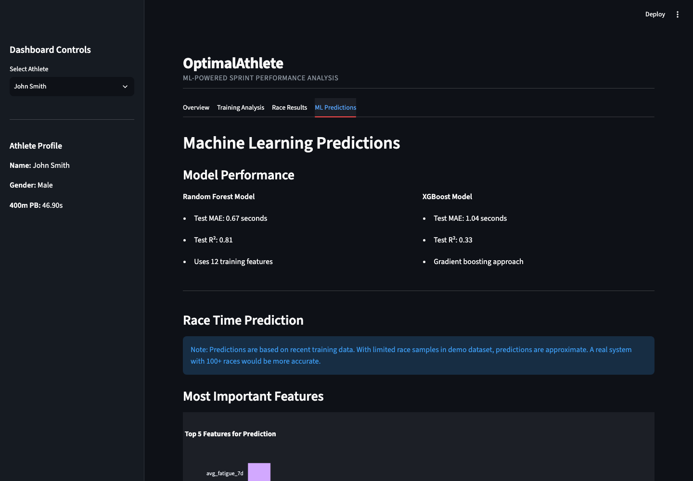
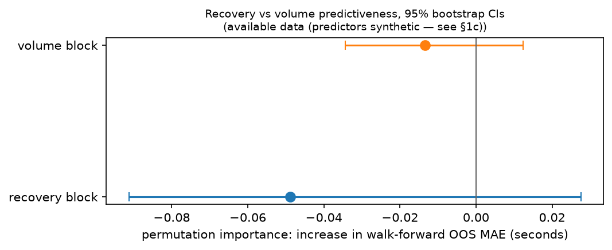
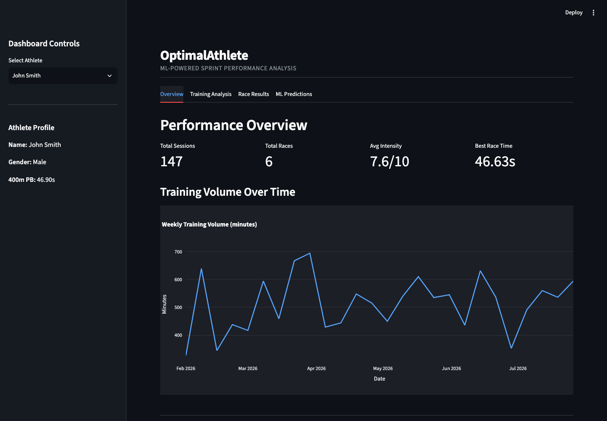
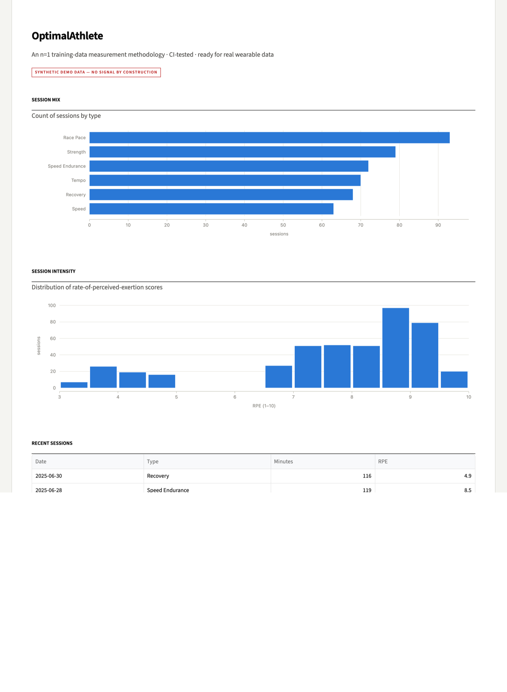

# OptimalAthlete

[](https://github.com/hugomagee/OptimalAthlete/actions/workflows/ci.yml)
[](https://www.python.org/downloads/)
[](LICENSE)

A machine learning pipeline that predicts 400m race times from training data. It is also the project where I caught data leakage in my own model, retracted the headline number, and rebuilt the evaluation properly.



## At a glance

**Input:** training sessions (intensity, duration), wellness metrics (HRV, sleep, fatigue) and race results, stored in SQLite

**Transformation:** 12 features built over real 7 and 14 day calendar windows, then Random Forest and XGBoost models scored with walk forward validation. Each race is predicted only from races before it, and the models are compared against a simple baseline: the athlete's recent average.

**Output:** a Streamlit dashboard, a metrics file, and a clear verdict on whether the models beat the baseline

**What I learned:** a high R² can come from the evaluation method rather than from the model

## The mistake, and how I proved it

My first version reported **R² = 0.84**. When I audited it, the problem was the split. Races from all athletes were pooled and split at random, so the model mostly learned which athlete was racing. About 95% of the variation in race times is between athletes, not within one athlete's season.

To prove that, the demo data in this repo is built with **no relationship at all** between training and race time (race time is personal best plus noise). There is nothing to learn, yet the two evaluation methods disagree sharply:

* **Old method (pooled random split): R² = 0.906.** On data with zero signal. This is not a result.
* **Walk forward (reported): Random Forest MAE 1.063s** over 163 races
* **Baseline, athlete's recent average: MAE 0.487s.** No ML at all, and it wins.

So walk forward correctly shows the models have no skill here, while the old method would have reported a strong result.

## Bugs I found and fixed in my own pipeline

* **"7 day" features counted sessions, not days.** `rolling(window=7)` is 7 rows, not 7 days, so an athlete training daily and one training every fourth day both showed 7 sessions a week. Now uses real calendar windows, with a regression test.
* **The pipeline contradicted its own audit.** The notebook showed the pooled split was leaky while `models.py` still used it. Walk forward is now the reported method.
* **Results changed every run.** The data generator was unseeded and tied to today's date. It is now seeded, so every clone gives the same numbers.
* **"15 features" was really 12.** Corrected, and the count is checked in the tests.

## The analysis notebook

[`analysis/recovery_vs_volume.ipynb`](analysis/recovery_vs_volume.ipynb) ([view on nbviewer](https://nbviewer.org/github/hugomagee/OptimalAthlete/blob/main/analysis/recovery_vs_volume.ipynb)) asks whether recovery quality predicted race times better than training volume did. On the data available, neither showed any predictive signal (the gap between them was 0.04s, with a 95% confidence interval that spans zero, n = 7 races). The audit also found the recovery and volume columns were synthetic, so I withdrew my earlier "2.3× more predictive" claim. CI runs the notebook on every push so the published figures can't drift from the code.



## How to run

Requires Python 3.12+.

```bash
git clone https://github.com/hugomagee/OptimalAthlete.git
cd OptimalAthlete
python3 -m venv venv && source venv/bin/activate
pip install -r requirements.txt
streamlit run dashboard.py
```

The first run builds the database, generates the demo data and trains the models. To run the pipeline without the dashboard, use `python data_loader.py` then `python models.py`. For the tests, use `pip install -r requirements-dev.txt && pytest && ruff check .` (31 tests).

## Screenshots

| Overview | Training analysis |
| :---: | :---: |
|  |  |

## How the code is organised

* `setup_db.py`, `database.py`: SQLite schema and connections
* `data_loader.py`: seeded demo data
* `feature_engineering.py`: calendar window features
* `models.py`: training, walk forward validation and the baseline
* `dashboard.py`, `theme.py`: Streamlit app
* `tests/`: 31 tests, including one that checks walk forward never uses future data
* `docs/ANALYSIS_NOTES.md`: why I made each methodology choice

## What it does not do

It does not recommend training. The data here gives no evidence for prescribing anything to an athlete.

## Next

* Real wearable data from Garmin or Strava exports
* Models per athlete once there is enough data for each one
* Other events (100m, 200m, 800m)

## Author

Hugo Magee · MSc Business Analytics and Data Science, IE University · 400m sprinter for Ireland · [LinkedIn](https://linkedin.com/in/hugo-magee-ooo)

MIT licence
